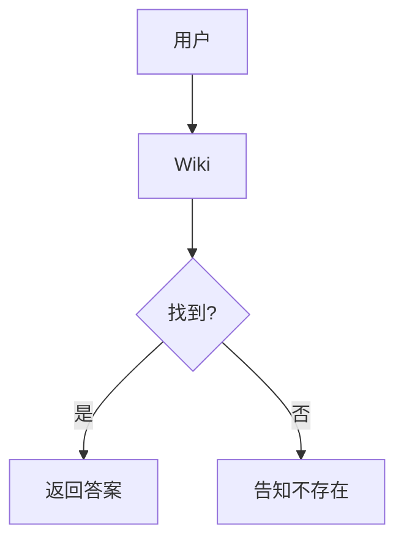
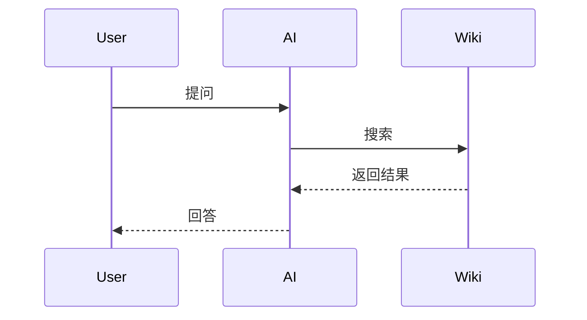

# 📈 Visualization

> 可视化

## 可视化方式

| 方式 | 工具 | 用途 |
|------|------|------|
| Graph View | Obsidian | 页面关系图 |
| 表格 | Markdown | 对比数据 |
| 图表 | Mermaid/PlantUML | 流程图 |
| 时间线 | Mermaid | 时间轴 |

---

## Mermaid 示例

### 流程图

### 序列图

---

## 图表工具

| 工具 | 类型 | 集成 |
|------|------|------|
| Mermaid | 多种 | Obsidian 原生 |
| PlantUML | 多种 | 插件 |
| Chart.js | 统计图 | HTML 导出 |
| Python | 任意 | Jupyter |

---

## 相关页面

- [[knowledge-graph]] — 知识图谱

---

*最后更新：2026-04-11*